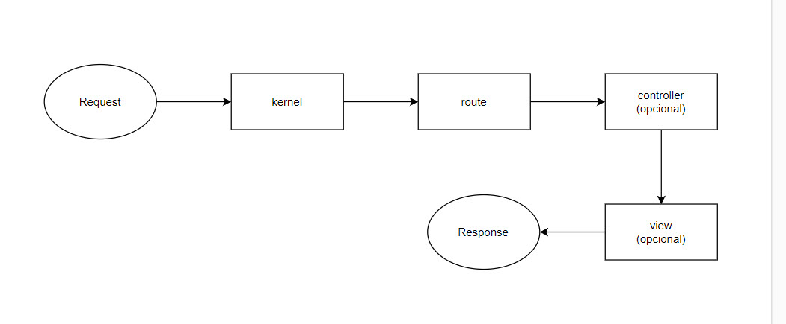
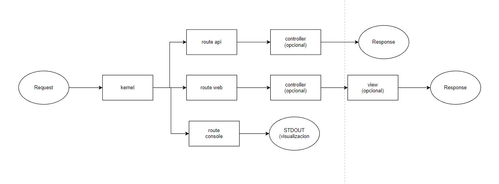
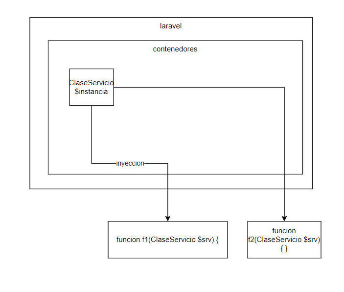

# composer

```bash
composer create-project laravel/laravel nombredelproyecto
```

Para agregar mas librerias, se pueden buscar aqui: 

* https://packagist.org/

Si no esta la carpeta vendor, se pueder correr el siguiente comando

```bash
composer update
```

# autoloader
Cuando se quiere usar el composer, se usa una funcion de autoloader que carga las clases automaticamente.

Para que funcione, necesito seguir las siguientes reglas:
* necesito trabajar con clases.
* el namespace debe corresponder a la carpeta y la clase debe llamarse igual que el archivo.
* ejemplo: /app/carpeta/Clase.php 

```php
namespace App\carpeta;
class Clase {


}
```
# artisan
Para crear las clases y vistas, se puede usar un programa de la linea de comando llamado artisan

```bash
php artisan <comando>
```

# flujo
* Flujo MVC:



* Flujos completos



# Ideologias de Laravel

## inyeccion de objetos

Supongamos que tenemos el siguiente metodo en una clase

```php
class Clase {
   public function f1(ClaseServicio $srv) {

   }
}
```
Cuando llamo a la funcion f1, Laravel va a intentar "inyectar" un objeto del tipo clase servicio.
* Si el objeto ya fue creado antes, usa ese objeto
* Si el objeto no fue creado, crea uno nuevo

Esto me ahorra hacer lo siguiente:
```php
class Clase {
   public function f1() {
        $instancia=new ClaseServicio(); // no es la forma laravel

   }
}
```



## Metodos estaticos

Cuando se llama a un metodo estatico, no es necesario crear una instancia, simplemente llamo a la clase desde cualquier lado.

```php
    View::make('pagina');
```

## Funciones globales
Las funciones globales se pueden llamar desde cualquier lado.

```php
  view("pagina");
```

# base de datos
laravel permite dos formas de trabajar con base de datos
* Eloquent (ORM)
* Database (consultas directas)

# vistas
Para las vistas, laravel utiliza Blade.
Ejemplo:
```html
  <ul>
  @foreach($paises in $pais)
    <li>{{$pais}}</li>
  @endofreach
  </ul>
```

# Como se crea un proyecto

1. primero crear un proyecto de laravel
2. configurar la variable del entorno.
3. editar el enrutador
4. editar el/los controlador
5. editar la/las vista
6. editar el/los modelos
7. (opcional) crear migracion
8. (opcional) crear factory
9. (opcional) creer un seeder o ocupar el existente
10. (opcional) crear componentes visuales
11. (opcional) crear request **<-- recomendado**
12. (opcional) crear o usar middleware (autenticacion)

## 1
```bash
composer create-project laravel/laravel nombredelproyecto
```

## 2 entorno
editar el archivo .env o editar las variables del entorno del sistema operativo.

## 6 modelo
Crear modelo, controlador, migracion, etc. al mismo tiempo
```bash
php artisan make:model Libro --all
```
En la carpeta app\Models, editar el modelo

```php
class Libro extends Model
{
    use HasFactory;
    protected $fillable = ['titulo','autor'];
}
```
## 7 migracion
En la carpeta database/migrations, editar la migracion.

```php
    public function up(): void
    {
        Schema::create('libros', function (Blueprint $table) {
            $table->id();
            $table->string('titulo');
            $table->string('autor');
            $table->timestamps();
        });
    }
```
Y luego, correr la migracion:

```bash
php artisan migrate:install
php artisan migrate:fresh
```
## 8 factory
Factory usa la libreria Faker para generar datos falso.
En la carpeta /database/factories, edite el archivo

```php
    public function definition(): array
    {
        return [
            'titulo' => fake()->words(2,true),
            'autor' => fake()->name(),
        ];
    }
```

## 9 seeder
Se puede trabajar en el seeder por defecto database/seeders/DatabaseSeeder.php o se puede usar uno creado

```php
    public function run(): void
    {
        Libro::factory(100)->create(); // crea 100 libros
        // \App\Models\User::factory(10)->create();

        // \App\Models\User::factory()->create([
        //     'name' => 'Test User',
        //     'email' => 'test@example.com',
        // ]);
    }
```
Y luego correr lo siguiente:

```bash
php artisan db:seed
```


## 3
## 4
En la carpeta app/Http/Controller se deben editar los controladores.
No es necesario usar las funciones que vienen de ejemplo
> En lo posible, mantenga el controlador limpio de codigo, NO ES NECESARIO HACER TODO EL CODIGO EN EL CONTROLADOR.
> En lo posible, no agregue el codigo de la base de datos aqui. Use una clase de servicio.

## 4.1 crear clase de servicio
* En la carpeta app, cree una nueva carpeta con el nombre que quiera
* Luego, cree un archivo PHP con el nombre de la clase
* Y la clase tienen que corresponder al archivo
* Y el namespace tiene que corresponder a la carpetya

```php
// app/Repo/LibroRepo.php
<?php
namespace App\Repo;
class LibroRepo {
    // aqui agregar las funciones que quiere usar
}
```


## 5
Para crear las vistas puede usar el siguiente comando
```bash
php artisan make:view libros.listar
php artisan make:view libros.insertar
```

Y edite la vista
```html
@extends('paginamaestra')
@section('contenido')
    <div class="col">
        <table class="table">
            <thead>
                <tr>
                    <th>Titulo</th>
                    <th>Autor</th>
                </tr>
            </thead>
            <tbody>
                @foreach ($libros as $libro)
                    <tr>
                        <td>{{ $libro->titulo }}</td>
                        <td>{{ $libro->autor }}</td>
                    </tr>
                @endforeach
            </tbody>

        </table>
    </div>
@endsection()
```


## 5.1
Opcionalmente se puede extender una vista. Usar extends.

## 3 enrutador
Vaya a la carpeta routes/web.php y agregue los enrutamientos

```php
Route::controller(LibroController::class)->prefix('libro')->group(function () {
    Route::get('/', [LibroController::class,'index'])->name('librolistar'); 
});
```

## 11 request
en app/http/requests edite el request que quiere usar:

```php

    public function authorize(): bool
    {
        return true;
    }

    public function rules(): array
    {
        return [
            'titulo'=>'required|max:30|alpha:ascii',
            'autor'=>'required|max:30|alpha:ascii'
        ];
    }
```

#  12 autenticacion (middleware)

1. agregar un usuario (puede ser con el tinker o con el seeder)

```php
User::factory()->create([
            'name' => 'admin',
            'email' => 'admin@admin.com',
            'password'=> Hash::make('clave')
        ]);
```

2. crear una pagina de login (opciona una pagina de logout) y un controlador.

```php
class LoginController extends Controller
{
    public function loginGet(Request $request) {
        if(count($request->old())>0) {
            $usuario=new User($request->old());
        } else {
            $usuario=new User();
        }        
        return view("login",['usuario'=>$usuario]);
    }
    public function loginPost(Request $request) {
        $credentials = $request->validate([
            'email' => ['required', 'email'],
            'password' => ['required'],
        ]);
 
        if (Auth::attempt($credentials)) {
            $request->session()->regenerate();
 
            return redirect()->intended('/libro');
        }
        return back()->withErrors([
            'email' => 'The provided credentials do not match our records.',
        ])->onlyInput('email');
    }
    public function logout(Request $request) {
        Auth::logout();
        $request->session()->invalidate();
        $request->session()->regenerateToken();     
        return redirect("/libro");
    }
}
```


3. agregar los middleware a las rutas

```php
Route::get('/login',[LoginController::class,'loginGET'])->name('login'); // una pagina tiene que tener el name login
Route::post('/login',[LoginController::class,'loginPOST']);
Route::get('/logout',[LoginController::class,'logout']);
// http://127.0.0.1:8000/libro
Route::controller(LibroController::class)->prefix('libro')->group(function () {
    Route::middleware('auth')->get('/', [LibroController::class,'index'])->name('librolistar'); 
    Route::middleware('auth')->get('/create', [LibroController::class, 'create'])->name('librocreate'); 
    Route::middleware('auth')->post('/create', [LibroController::class, 'store']);
});
```